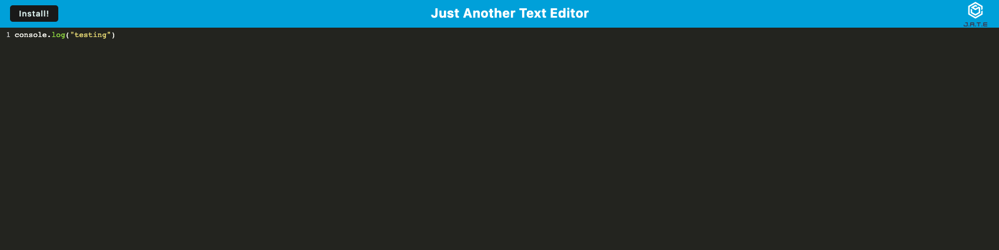
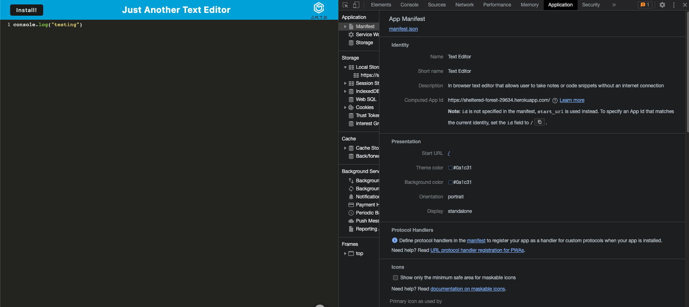
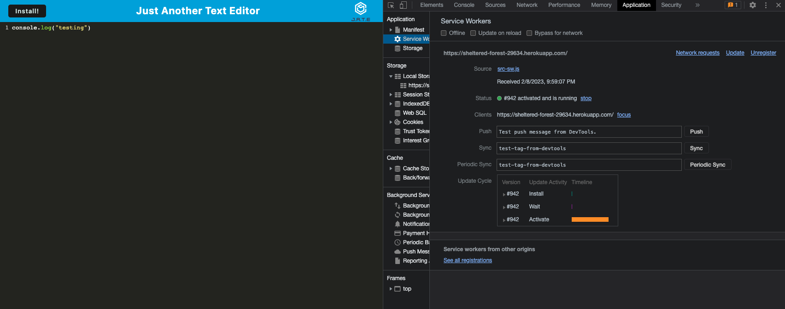
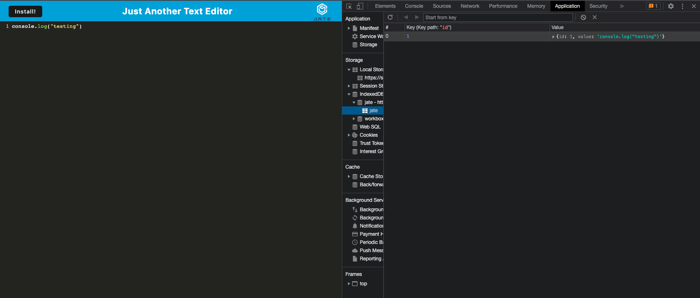

# text-editor
Module 19 Homework - Progressive Web Applications (PWA): Text Editor

## Table of Contents
1. [Description](#Description)
2. [User-Stories](#User-Stories)
3. [Acceptance-Criteria](#Acceptance-Criteria)
4. [Mockup](#Mockup)
5. [Deployed-Application](#Deployed-Application)
6. [Questions](#Questions)

# Description
***
###### [Back to Table of Contents](#Table-of-Contents)
The assignment was to update starter code to for a text editor using Progressive Web Application concepts. The txt editor should be usable even when offline.

## User Stories
***
###### [Back to Table of Contents](#Table-of-Contents)
```
AS A developer
I WANT to create notes or code snippets with or without an internet connection
SO THAT I can reliably retrieve them for later use
```

## Acceptance Criteria
***
###### [Back to Table of Contents](#Table-of-Contents)
```
GIVEN a text editor web application
WHEN I open my application in my editor
THEN I should see a client server folder structure
WHEN I run `npm run start` from the root directory
THEN I find that my application should start up the backend and serve the client
WHEN I run the text editor application from my terminal
THEN I find that my JavaScript files have been bundled using webpack
WHEN I run my webpack plugins
THEN I find that I have a generated HTML file, service worker, and a manifest file
WHEN I use next-gen JavaScript in my application
THEN I find that the text editor still functions in the browser without errors
WHEN I open the text editor
THEN I find that IndexedDB has immediately created a database storage
WHEN I enter content and subsequently click off of the DOM window
THEN I find that the content in the text editor has been saved with IndexedDB
WHEN I reopen the text editor after closing it
THEN I find that the content in the text editor has been retrieved from our IndexedDB
WHEN I click on the Install button
THEN I download my web application as an icon on my desktop
WHEN I load my web application
THEN I should have a registered service worker using workbox
WHEN I register a service worker
THEN I should have my static assets pre cached upon loading along with subsequent pages and static assets
WHEN I deploy to Heroku
THEN I should have proper build scripts for a webpack application
```

## Mockup
***
###### [Back to Table of Contents](#Table-of-Contents)
The following animation demonstrates the application functionality:



The following image shows the application's `manifest.json` file:



The following image shows the application's registered service worker:



The following image shows the application's IndexedDB storage:



## Deployed Application
***
###### [Back to Table of Contents](#Table-of-Contents)

https://sheltered-forest-29634.herokuapp.com/

## Credits
***
###### [Back to Table of Contents](#Table-of-Contents)
GT Bootcamp Tutors

## License
***
###### [Back to Table of Contents](#Table-of-Contents)
MIT

# Questions
***
###### [Back to Table of Contents](#Table-of-Contents)
Review my GitHub Repo: https://github.com/jae-as
Email me: janaee.as.wallace@gmail.com

